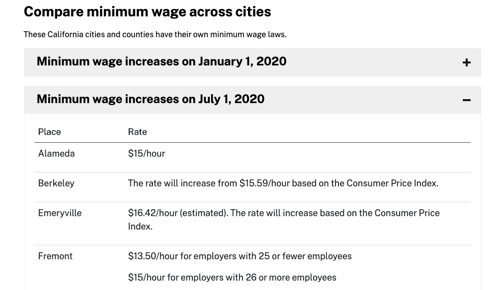

# Accordion component

This custom element recreates the bootstrap accordion component functionality without the jquery dependency. 
It is designed for use on https://covid19.ca.gov.




## Sample markup

```
<cagov-accordion>
  <div class="card">
    <button class="card-header accordion-alpha" type="button" aria-expanded="false">
      <div class="accordion-title">Who can get a Cal Grant</div>
      <div class="plus-munus">
        <cagov-plus></cagov-plus><cagov-minus></cagov-minus>
      </div>
    </button>
    <div class="card-container collapsed">
      <div class="card-body">
        <p>Anim pariatur cliche reprehenderit, enim eiusmod high life accusamus terry richardson ad squid. 3 wolf moon officia aute, non cupidatat skateboard dolor brunch. Food truck quinoa nesciunt laborum eiusmod. Brunch 3 wolf moon tempor, sunt aliqua put a bird on it squid single-origin coffee nulla assumenda shoreditch et. Nihil anim keffiyeh helvetica, craft beer labore wes anderson cred nesciunt sapiente ea proident. Ad vegan excepteur butcher vice lomo. Leggings occaecat craft beer farm-to-table, raw denim aesthetic synth nesciunt you probably haven't heard of them accusamus labore sustainable VHS.</p>
      </div>
    </div>
  </div>
</cagov-accordion>
```
